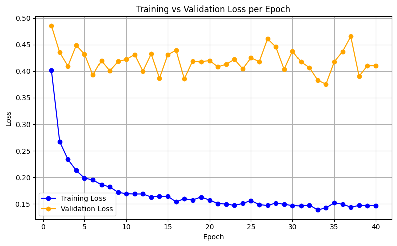
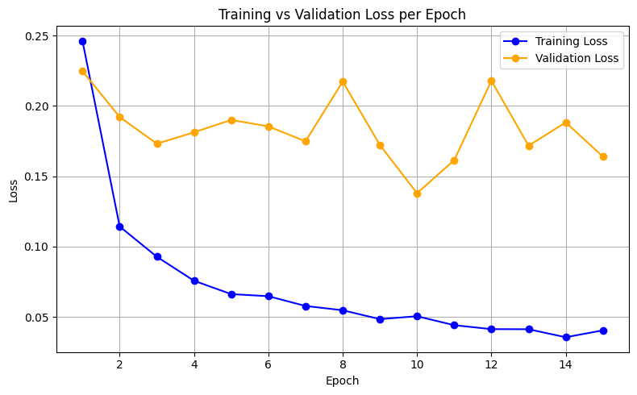

# Pneumonia Detection using MobileNetV2 — Transfer Learning with PyTorch

A deep learning project that classifies chest X-ray images as **Normal** or **Pneumonia** using a fine-tuned MobileNetV2 architecture trained with PyTorch.

---

## Results

### Attempt 1: Baseline Model (Overfitting & Instability)
> Trained for 40 epochs without data augmentation. The model memorized the training data instead of learning general patterns — a classic overfitting problem.



**Problems observed:**
- Validation Loss stuck at ~0.40 (model was twice as wrong)
- Large gap between Training and Validation Loss (overfitting)
- Unstable, noisy validation curve

---

### Attempt 2: Optimized Model (Data Augmentation + Fine-Tuning)
> After diagnosing the problem, I applied Data Augmentation and reduced epochs. The model converged faster and generalized much better.



**Improvements achieved:**
- Validation Loss reduced to ~0.16 (highly accurate)
- Smooth, stable convergence curve
- Controlled gap between Training and Validation Loss (no overfitting)
- Better results in 15 epochs than 40 epochs previously

---

## Model Performance

| Metric | Value |
|:---|:---|
| Architecture | MobileNetV2 (Transfer Learning) |
| Pre-trained Weights | ImageNet |
| Epochs | 15 |
| Final Validation Loss | ~0.16 |
| Final Test Accuracy | 93.26923076923077 % |
| Optimizer | Adam (lr=0.001) |
| Loss Function | CrossEntropyLoss |

---

## Dataset

**Chest X-Ray Images (Pneumonia)** — sourced from [Kaggle](https://www.kaggle.com/datasets/paultimothymooney/chest-xray-pneumonia).

```
chest_xray/
├── train/
│   ├── NORMAL/       (1341 images)
│   └── PNEUMONIA/    (3875 images)
├── val/
│   ├── NORMAL/       (8 images)
│   └── PNEUMONIA/    (8 images)
└── test/
    ├── NORMAL/       (234 images)
    └── PNEUMONIA/    (390 images)
```

---

## Architecture

I used **Transfer Learning** with MobileNetV2 — a lightweight CNN pre-trained on ImageNet. Instead of training from scratch (which requires millions of images), I:

1. **Reused** all the convolutional layers that already know how to detect edges, shapes, and textures.
2. **Replaced** only the final classification layer to output 2 classes (Normal vs Pneumonia) instead of the original 1000 ImageNet classes.

```python
model = models.mobilenet_v2(weights=models.MobileNet_V2_Weights.DEFAULT)

num_features = model.classifier[1].in_features   # 1280
model.classifier[1] = nn.Linear(num_features, 2) # New layer: 1280 → 2
```

---

## Key Techniques Used

### 1. Transfer Learning
Used pre-trained ImageNet weights for faster convergence. The model already understood basic visual features from day one.

### 2. Data Augmentation
Applied `RandomHorizontalFlip` and `RandomResizedCrop` to the training set to artificially increase diversity and prevent the model from memorizing images.

```python
train_transform = transforms.Compose([
    transforms.Resize((224, 224)),
    transforms.RandomRotation(10),      # Rotate slightly
    transforms.RandomResizedCrop(224, scale=(0.8, 1.0)), # Zoom in/out
    transforms.RandomHorizontalFlip(),
    transforms.ToTensor(),
    transforms.Normalize([0.485, 0.456, 0.406], [0.229, 0.224, 0.225])
])
```

### 3. Proper Train / Val / Test Split
- **Train set**: Used to update model weights via backpropagation.
- **Validation set**: Checked after each epoch to monitor generalization (weights NOT updated).
- **Test set**: Used only once at the very end for a final, unbiased accuracy score.

---

## How to Run

### Option 1: Google Colab (Recommended — Free GPU)

1. Upload `archive.zip` to your Google Drive.
2. Open `Pneumonia_classification_mobilenetV2_new.ipynb` in Google Colab.
3. Go to **Runtime > Change runtime type > T4 GPU**.
4. Run all cells.

### Option 2: Local Machine

```bash
# Install dependencies
pip install torch torchvision matplotlib

# Run training
python pneumonia_colab.py
```

---

## Project Structure

```
Pneumonia_MobilenetV2/
├── pneumonia_colab.py          # Main training script (Colab-ready)
├── graphs/
│   ├── baseline_40epoch.png    # Attempt 1: overfitting graph
│   └── optimized_15epoch.png   # Attempt 2: final optimized graph
├── mobilenetv2_pneumonia.pth   # Saved trained model weights
└── README.md
```

---

## What I Learned

- How **Convolutional Neural Networks** extract features from images layer by layer.
- The concept of **Transfer Learning** and why it drastically reduces training time.
- How to diagnose **overfitting** by comparing Training vs Validation Loss curves.
- The difference between **Training, Validation, and Test sets** and when to use each.
- How **backpropagation** and the **Adam optimizer** update model weights batch by batch.

---

## Dependencies

```
torch
torchvision
matplotlib
```
